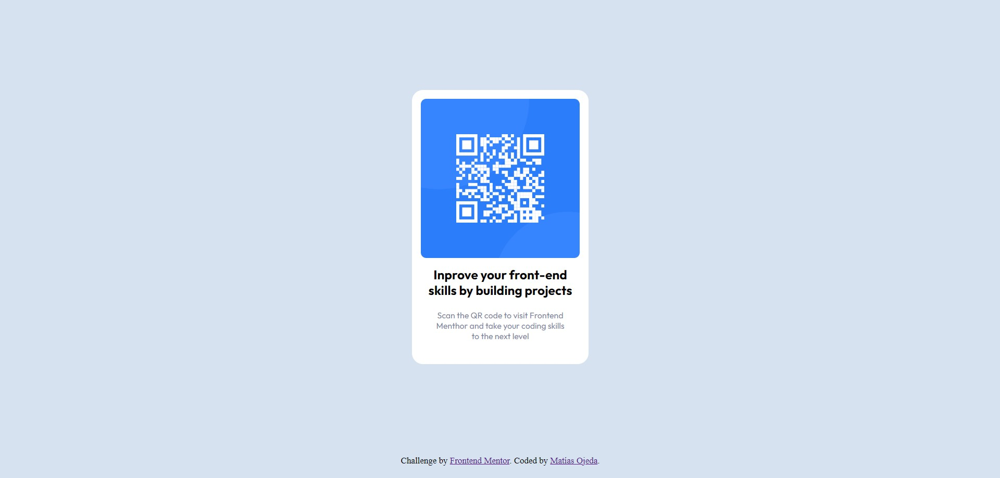

# Frontend Mentor - QR code component solution
This is a solution to the [QR code component challenge on Frontend Mentor](https://www.frontendmentor.io/challenges/qr-code-component-iux_sIO_H). Frontend Mentor challenges help you improve your coding skills by building realistic projects. 

## Table of contents
- [Overview](#overview)
  - [Screenshot](#screenshot)
  - [Links](#links)
- [My process](#my-process)
  - [Built with](#built-with)
  - [What I learned](#what-i-learned)
  - [Continued development](#continued-development)
- [Author](#author)

## Overview
This repository contains my solution for the front-end menthor "QR code" challenge.
I'm Matías, web development student.

### Screenshot

### Links
- Solution URL: [Add solution URL here](https://sdmatias.github.io/practiceQRcodeFM/)

## My process
My process consisted of writing the HTML code first, placing the classes to be able to use them when writing the CSS code. Once the HTML is written, link the style sheet in the head section of the HTML and also the fonts from google-fonts. Once the previous steps were done, I started writing the CSS code starting with the main box and continuing with the lower level ones. Use flexbox to center the boxes.
Finally, configure the git hub repository and register the page with git pages.

### Built with
- Semantic HTML5 markup
- CSS custom properties
- Flexbox

### What I learned
Strengthen my knowledge of HTML and CSS. I learned how to configure the repositories on GitHub, I learned how to use the GitBash command line and GitHubPages.

### Continued development
I want to continue refining my HTML and CSS skills, start learning JS so I can become a front-end web developer.

## Author
- Website - [Support Device](https://sprtdevice.blogspot.com/)
- Frontend Mentor - [@sdmatias](https://www.frontendmentor.io/profile/sdmatias)
- Twitter - [@sprtdevice](https://www.twitter.com/sprtdevice)